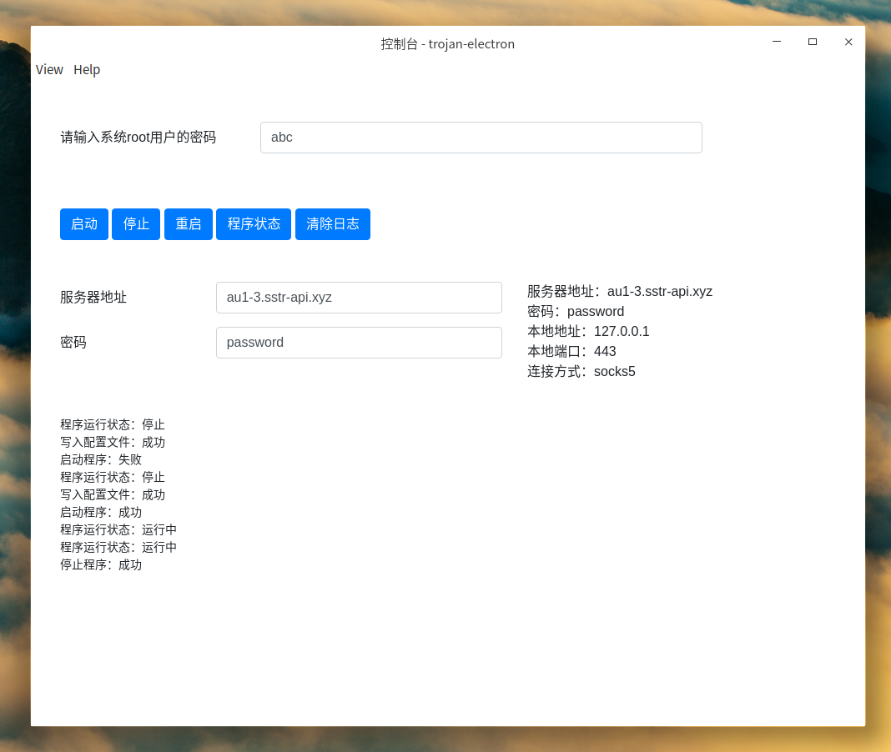
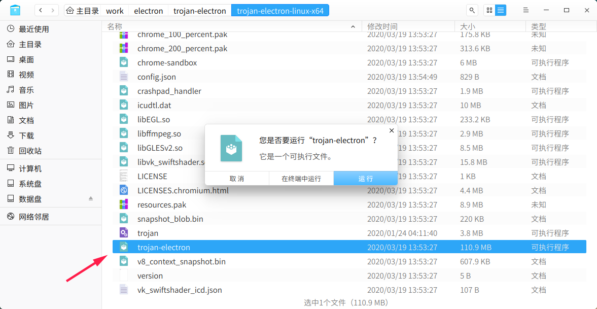

# trojan-electron

trojan dashboard electron version (for linux)

## preview

## description

起因：trojan的linux版本没有图形界面，只有命令行工具

用 https://shadowsocks.com/ 提供的trojan服务时，可能经常需要更换服务器地址和密码。

## download

[trojan-electron-linux-x64.tar.gz](./package/trojan-electron-linux-x64.tar.gz)

下载后解压，找到 trojan-election 文件，双击运行（如果文件没有执行权限，需要加上）

trojan需要root权限才能启动，所以需要输入root密码。

别忘了输入服务器地址和密码，服务器配置信息只需要输入一次。

