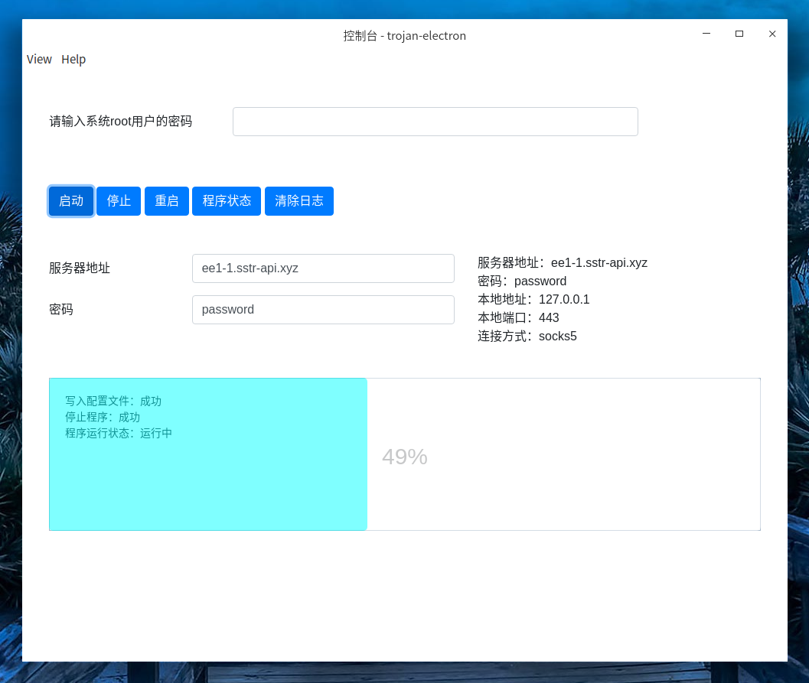
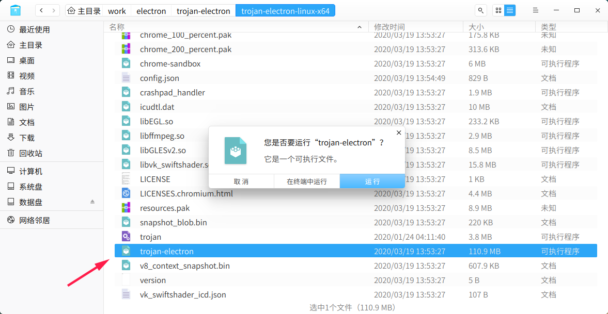

# trojan-electron

trojan dashboard electron version (for linux)

## preview

## description

起因：trojan的linux版本没有图形界面，只有命令行工具

使用 https://shadowsocks.com/ 提供的trojan服务时，可能经常需要更换服务器地址，然后重启，测试网络，再更换配置，重启……命令行操作起来比较繁琐。图形界面上可以一建重启，不用一次次敲命令了。

trojan需要root权限才能启动，所以需要输入root密码。

别忘了输入服务器地址和密码，服务器配置信息输入一次后会保存下来。

## download

[trojan-electron-linux-x64.tar.gz](https://github.com/smallyunet/trojan-electron/releases/download/v0.0.2/trojan-electron-linux-x64.tar.gz)

下载后解压，找到 trojan-election 文件，双击运行（如果文件没有执行权限，需要加上）

